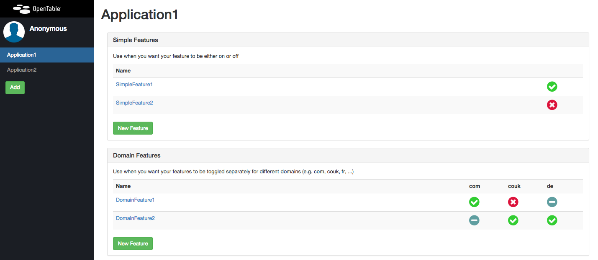
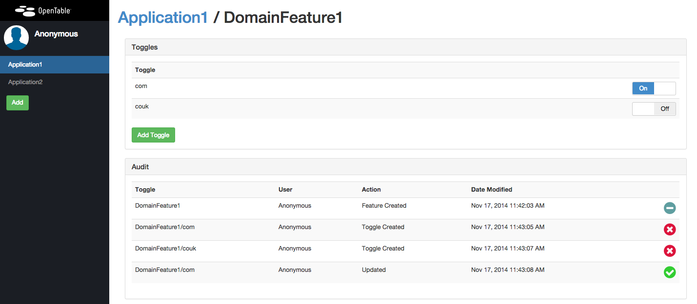
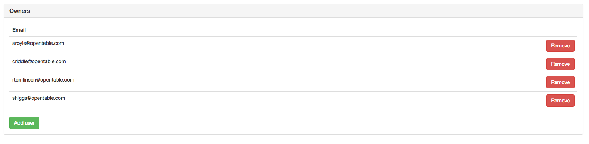

Hobknob
======================

[](https://travis-ci.org/opentable/hobknob)
[](http://standards-badges.herokuapp.com/?serviceStatusEndpoint=0&logSchema=0&githubReadme=1)
[](https://gitter.im/opentable/hobknob?utm_source=badge&utm_medium=badge&utm_campaign=pr-badge&utm_content=badge)

Hobknob is a feature toggle front-end built on top of [etcd](https://github.com/coreos/etcd).
It allows users to create and modify feature toggles, which can then be accesesed in your applications.

### Convention
Features in Hobknob are grouped by application. Each application can have many, uniquely named features. Each feature will either have one on/off toggle or many on/off toggles (see `Categories` below). This gives us a simple way to identify toggles - `ApplicationName/FeatureName[/SecondaryKey]`.

### Categories
Sometimes we need more granularity when toggling features, for example, a feature might be turned on for the .com website but not for the .co.uk website.

Hobknob has the concept of feature categories, where you can define secondary keys for each feature. This gives you the ability to set and get toggle values for `App/Feature/SecondaryKey`.

For the above example, we could define a category called 'Domain Feature Toggles' and set the list of possible key values as `['com', 'couk', 'fr', 'de', ...]`. Then we could set `App/Feature/com` to true and `App/Feature/couk` to false.

### Audit
An audit log of all changes is created in etcd and is visible un the UI. When using the authentication mode, usernames will be auditted alongside the changes.

### Etcd
Etcd is a good fit for feature toggles. It has a good http API to query the state of the toggle, and an eventing system to notify consumers of changes.
More information on etcd can be found here: [etcd](https://github.com/coreos/etcd).

## Screenshots

### Application View


### Feature View


### Running the application

## Vagrant
The quickest way to run the app locally is to use Vagrant. If you don't have Vagrant you should install it from [here](http://www.vagrantup.com/).
`vagrant up` will spin up a vagrant instance and install etcd and Hobknob, which are exposed on ports 4001 and 3006 respectfully.
Hobknob itself is deployed in a Docker container inside of the vagrant instance.

### Notes
There seems to be an existing issue with Vagrant version 1.7.2 when attempting to install Docker. Currently, Vagrant version 1.7.4 will work.

## Manual
The application is dependant on NodeJS version 0.10.26. This can be downloaded [here](http://nodejs.org/download/).

### etcd
A local (or development) installation of Hobknob is configured to use a locally running etcd instance. A useful guide is available [here](https://github.com/coreos/etcd#building).
Or, here is a simple way to etcd up and running on a Mac:

```sh
$ curl -L https://github.com/coreos/etcd/releases/download/v0.4.6/etcd-v0.4.6-darwin-amd64.zip | tar xvz
$ cd etcd-v0.4.6-darwin-amd64
$ ./etcd
```

### Hobknob

The following will checkout and run Hobknob (accessible http://127.0.0.1:3006/).

```sh
$ git clone git@github.com:opentable/hobknob.git
$ cd hobknob
$ npm install
$ grunt
$ npm start
```

# Preparing the config

To generate the client-side config, you need to run the following command (until we find a better solution):
```sh
$ grunt
```

You can then access the site on http://127.0.0.1:3006

## Testing with Protractor
We've integrated [protractor](https://github.com/angular/protractor) for end-to-end testing. To start these tests run:

```sh
# Make sure you have the app running first
$ npm test
```

## Configuring Feature Categories
You can define the feature categories in the confuration file (config/config.json). Note, category id 0 is reserved for the simple, single value feature toggle category (however, you can still specify it in the config to set the name and description).

Example:

```javascript
{
    ...

    "categories": [
        {
            "id": 0, // id = 0 is reserved for the simple feature category only. Name and description are optional
            "name": "Simple Features",
            "description": "Use when you want your feature to be either on or off"
        },
        {
            "id": 1,
            "name": "Domain Features",
            "description": "Use when you want your features to be toggled separately for different domains (e.g. com, couk, fr, ...)",
            "values": ["com", "couk", "de", "fr"] // must define values when id != 0
        }
    ]
}
```

## Configuring Authentication
By default Hobknob ships with authentication disabled. This is configurable by changing the config/config.json config file.

### Turning on Google OAuth
First you must generate a google oauth client Id and client secret. To do this visit the [Google Developer Console](https://console.developers.google.com/project) and create a new project. Select this project once created and go into the section "APIs and auth" in the left hand menu. From here you can create a new oath client Id.

To use oath in Hobknob add the following to your config (config/confg.json).

```
{
  "RequiresAuth": true,
  "AuthProviders":{
    "GoogleAuth": {
      "GoogleClientId": "somecientid.apps.googleusercontent.com",
      "GoogleClientSecret": "somesecretkey"
    }
  }
}
```

This configuration is shared with Angular so you need to run the following:
```sh
$ grunt
```

#### Extra Authentication params (ie: `hd` param for domain limitation on Google Auth)

You can add an `authentication` object to the `GoogleAuth` object in your config in order to use extra parameters, like the `hd` Google Auth param. This will limit the valid Google accounts to a specific domain (for Google Apps).


```
{
  "RequiresAuth": true,
  "AuthProviders":{
    "GoogleAuth": {
      "GoogleClientId": "somecientid.apps.googleusercontent.com",
      "GoogleClientSecret": "somesecretkey",
      "authentication":{  
        "hd":"example.com"
      }
    }
  }
}
```


see https://developers.google.com/identity/protocols/OpenIDConnect#hd-param


### Access Control List
When authentication is enabled, you can control who is allowed to add, update, or delete toggles per application.

The creator of an application is automatically an owner of that application. Application owners can add other owners via the Owners panel in the Application View.



If in an emergency, you need to be added to an application's ACL, you can use this command:

```
curl -L -X PUT http://<etcd_host>:<etcd_port>/v2/keys/v1/toggleAcl/<application-name>/<email> -d value=<email>
```

## Configuring Session
By default session is stored in-memory using the expressjs connect middleware. For a single machine environment this is fine. When you have multiple load balanced machines you probably want to use some kind of shared stored. Hobknob currently supports [Redis](https://github.com/visionmedia/connect-redis) or [etcd](https://github.com/opentable/connect-etcd) connect middleware.

Configuring session is simple. Just npm install the module you want to use. For example, to use etcd to store session simple use:

```
npm install connect-etcd --save
```

Hobknob will realise the package is installed and assume that you therefore want to use it for session storage.

The configuration for the session is also stored in the config/config.json file using the following:

```json
{
  "etcdHost": "hobknob-etcd.yourenvironment.com",
  "etcdPort": "4001",
}
```
## Configuring Logging
By default, express has been configured to use a dev logger to stdout. You can configure to use different logging middleware by supplying configuration in config/config.json file.

```json
{
  "loggingMiddleware": {
    "path": "./logging_module",
    "settings": { }
  }
}
```

Note, the module must be a function with the following standard express middleware signature: `function(settings) { return function(req, res, next) { }; }`

### Example

In a file called simple-console.js:

```javascript
module.exports = function(settings) {
  return function(req, res, next) {
    if (settings.enabled) {
      console.log('request: ' + req.path);
    };
  };
};
```

config/config.json:
```json
{
  ...
   "loggingMiddleware": {
     "path": "./simple-console",
     "settings": {
       "enabled": true
     }
   }
}
```

## Feature hooks
You can add custom hooks that will run for feature-events (add, delete, update), E.g. reporting toggle events to slack, hipchat etc.

The hooks can implement any or all of the interface methods specified [here](server/exampleHook.js). The function signature is `function(eventInfo, next){}` where `next` is a callback taking one argument (an error).

Register your hooks by adding them to the `hooks` array in the configuration file:

```
  "hooks": [
    "server/exampleHook.js"
  ]
```

## Hobknob Clients
There are several clients for different languages.

- https://github.com/opentable/hobknob-client-nodejs
- https://github.com/opentable/hobknob-client-net
- https://github.com/opentable/hobknob-client-java
- https://github.com/opentable/hobknob-client-go

## Release Notes

### 2.0.x Breaking audit trail changes

Feature audits are now stored in the following etcd directory: `http://etcd_host:etcd_port/v2/keys/v1/audit/feature/`.

Use the included script to migrate the audit trail made in versions of Hobknob prior to release 2.0.

```sh
node scripts/migrate_etcd_audit_2.0.js <etcd_host> <etcd_port>
```
