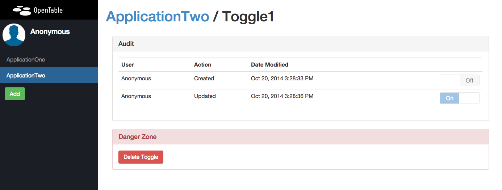

Hobknob
======================

[](http://standards-badges.herokuapp.com/?serviceStatusEndpoint=0&logSchema=0&githubReadme=1)

Hobknob is a feature toggle front-end built on top of [etcd](https://github.com/coreos/etcd).
It allows users to create, maintain, and set feature toggles. It will also keep an audit of all changes. 

Etcd is a good fit for feature toggles. It has a good http API to query the state of the toggle, and an eventing system to notify consumers of changes.
More information on etcd can be found here: [etcd](https://github.com/coreos/etcd).

## Screenshots

### Application View


### Toggle View


### Running the application

## Vagrant
The quickest way to run the app locally is to use Vagrant. If you don't have Vagrant you should install it from [here](http://www.vagrantup.com/).
`vagrant-up` will spin up a vagrant instance and install etcd and Hobknob, which are exposed on ports 4001 and 3006 respectfully.
Hobknob itself is deployed in a Docker container inside of the vagrant instance.

## Manual
The application is dependant on NodeJS version 0.10.26. This can be downloaded [here](http://nodejs.org/download/).

### etcd
A local (or development) installation of Hobknob is configured to use a locally running etcd instance. A useful guide is available [here](https://github.com/coreos/etcd#building).
Or, here is a simple way to etcd up and running on a Mac:

```sh
$ curl -L https://github.com/coreos/etcd/releases/download/v0.4.6/etcd-v0.4.6-darwin-amd64.zip | tar xvz
$ cd etcd-v0.4.6-darwin-amd64
$ ./etcd
```

### Hobknob

The following will checkout and run Hobknob (accessible http://127.0.0.1:3006/).

```sh
$ git clone git@github.com:opentable/hobknob.git
$ cd hobknob
$ npm install
$ grunt
$ npm start
```

# Preparing the config

To generate the client-side config, you need to run the following command (until we find a better solution):
```sh
$ grunt
```

You can then access the site on http://127.0.0.1:3006

## Testing with Protractor
We've integrated protractor for end-to-end testing. To start these tests run:

```sh
# Make sure you have the app running first
$ npm test
```

## Configuring Authentication
By default Hobknob ships with authentication disabled. This is configurable by changing the config/config.json config file.

### Turning on Google OAuth
First you must generate a google oauth client Id and client secret. To do this visit the [Google Developer Console](https://console.developers.google.com/project) and create a new project. Select this project once created and go into the section "APIs and auth" in the left hand menu. From here you can create a new oath client Id.

To use oath in Hobknob add the following to your config (config/confg.json).

```
{
  "RequiresAuth": true,
  "AuthProviders":{
    "GoogleAuth": {
      "GoogleClientId": "somecientid.apps.googleusercontent.com",
      "GoogleClientSecret": "somesecretkey"
    }
  }
}
```

This configuration is shared with Angular so you need to run the following:
```sh
$ grunt 
```

### Access Control List
When authentication is enabled, you can control who is allowed to add, update, or delete toggles per application.
 
The creator of an application is automatically an owner of that application. Application owners can add other owners via the Owners panel in the Application View.


If in an emergency, you need to be added to an application's ACL, you can use this command:

```
curl -L -X PUT http://<etcd_host>:<etcd_port>/v2/keys/v1/toggleAcl/<application-name>/<email> -d value=<email>
```

## Configuring Session
By default session is stored in-memory using the expressjs connect middleware. For a single machine environment this is fine. When you have multiple load balanced machines you probably want to use some kind of shared stored. Hobknob currently supports [Redis](https://github.com/visionmedia/connect-redis) or [etcd](https://github.com/opentable/connect-etcd) connect middleware.

Configuring session is simple. Just npm install the module you want to use. For example, to use etcd to store session simple use:

```
npm install connect-etcd --save
```

Hobknob will realise the package is installed and assume that you therefore want to use it for session storage.

The configuration for the session is also stored in the config/config.json file using the following:

```json
{
  "etcdHost": "hobknob-etcd.yourenvironment.com",
  "etcdPort": "4001",
}
```
## Configureing Logging
By default, express has been configured to use a dev logger to stdout. You can configure to use different logging middleware by supplying configuration in config/config.json file.

```json
{
  "loggingMiddleware": {
    "path": "./logging_module",
    "settings": { }
  }
}
```

Note, the module must be a function with the following standard express middleware signature: `function(settings) { return function(req, res, next) { }; }`

## Hobknob Clients
There are several clients for different languages.

- https://github.com/opentable/hobknob-client-nodejs
- https://github.com/opentable/hobknob-client-net
- https://github.com/opentable/hobknob-client-java
- https://github.com/opentable/hobknob-client-go

