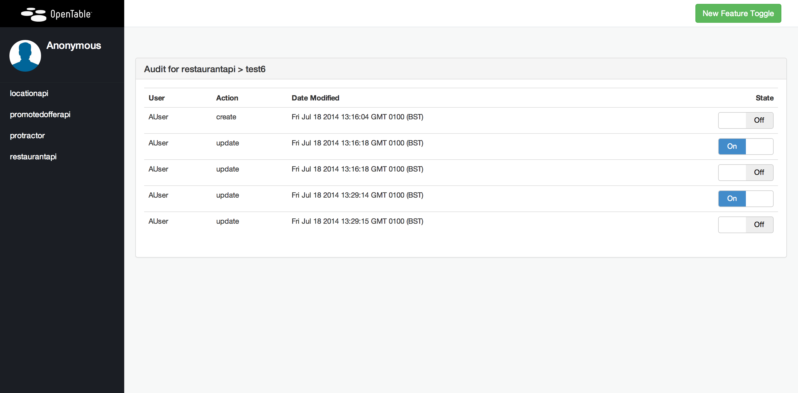

hobknob
======================

Hobknob is a feature toggle front-end built on top of [etcd](https://github.com/coreos/etcd). It allows users to create, maintain and toggle feature toggles and keeps an audit of all changes. 

The benefit of using etcd as a data store is that there is no need to write an additional API to query for toggles, or a eventing system to update consumers, as it is baked into etcd. Etcd has its own implementation using [long polling](https://github.com/coreos/etcd/blob/master/Documentation/api.md#waiting-for-a-change).

###Screenshots

#####The Dashboard

#####Creating Toggle

#####Audit View


###Running the app locally
The quickest way to run the app locally is to use Vagrant. If you don't have Vagrant you should install it from [here](http://www.vagrantup.com/).

#####Running using Vagrant
`vagrant-up` will spin up a vagrant instance and install etcd and the app in a Docker container with the application running on port 3006

#####Running manually
The application is written against NodeJS version 0.10.26. This should be installed prior to trying to run the application. After checkout you should install dependencies using npm.

Hobknob relies on you having a local install of etcd. To get it running look at [the docs](https://github.com/coreos/etcd#building) it's incredibly easy to get running. Make sure you start it up with the -cors flag:

```sh
$ ./bin/etcd -cors http://127.0.0.1:3006
```

```sh
# Clone the app
$ git clone git@github.com:opentable/hobknob.git
$ cd hobknob

# Install npm
$ sudo npm install -y

# Install bower dependencies
$ npm install -g bower
$ bower install

# Prepare config (this is a temporary measure)
$ grunt

# Run the app
$ node server/dev-app.js

```

You can then access the site on http://127.0.0.1:3006

###Testing with Protractor
We've integrated protractor for end-to-end testing. To start these tests run:

```sh
# Make sure you have the app running first
$ grunt test
```

### Configuring Authentication
By default Hobknob ships with authentication disabled. This is configurable by changing the config/config.json config file.

#### Turning on Google OAuth
First you must generate a google oauth client Id and client secret. To do this visit the [Google Developer Console](https://console.developers.google.com/project) and create a new project. Select this project once created and go into the section "APIs and auth" in the left hand menu. From here you can create a new oath client Id.

To use oath in Hobknob add the following to your config (config/confg.json).

```
{
  "RequiresAuth": true,
  "AuthProviders":{
    "GoogleAuth": {
      "GoogleClientId": "somecientid.apps.googleusercontent.com",
      "GoogleClientSecret": "somesecretkey"
    }
  }
}
```

This configuration is shared with Angular so you need to run the following:
```
grunt 
```

### Configuring Session
By default session is stored in-memory using the expressjs connect middleware. For a single machine environment this is fine. When you have multiple load balanced machines you probably want to use some kind of shared stored. Hobknob currently supports [Redis](https://github.com/visionmedia/connect-redis) or [etcd](https://github.com/opentable/connect-etcd) connect middleware.

Configuring session is simple. Just npm install the module you want to use. For example, to use etcd to store session simple use:

```
npm install connect-etcd --save
```

Hobknob will realise the package is installed and assume that you therefore want to use it for session storage.

The configuration for the session is also stored in the config/config.json file using the following:

```
{
  "etcdHost": "hobknob-etcd.yourenvironment.com",
  "etcdPort": "4001",
}
```

## Hobknob Clients
There are several clients for different languages.

- https://github.com/opentable/hobknob-client-nodejs
- https://github.com/opentable/hobknob-client-net
- https://github.com/opentable/hobknob-client-java
- https://github.com/opentable/hobknob-client-go

