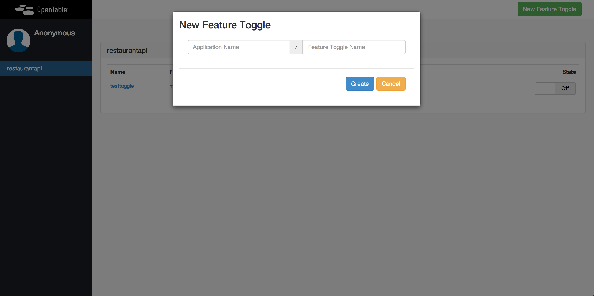

hobknob
======================

Hobknob is a feature toggle front-end built on top of etcd. It allows users to create, maintain and toggle feature toggles and keeps an audit of all changes. 

The benefit of using etcd as a data store is that there is no need to write an additional API to query for toggles, or a eventing system to update consumers, as it is baked into etcd. Etcd has its own implementation using [long polling](https://github.com/spotify/puppetexplorer).

###Screenshots

#####The Dashboard




###Running the app locally
The quickest way to run the app locally is to use Vagrant. If you don't have Vagrant you should install it from [here](http://www.vagrantup.com/).

#####Running using Vagrant
`vagrant-up` will spin up a vagrant instance and install etcd and the app in a Docker container with the application running on port 3006

#####Running manually
The application is written against NodeJS version 0.10.26. This should be installed prior to trying to run the application. After checkout you should install dependencies using npm.

Hobknob relies on you having a local install of etcd. To get it running look at [the docs](https://github.com/coreos/etcd#building) it's incredibly easy to get running. Make sure you start it up with the -cors flag:

```sh
$ ./bin/etcd -cors http://127.0.0.1:3006
```

```sh
# Clone the app
$ git clone git@github.com:opentable/hobknob.git
$ cd hobknob

# Install npm
$ sudo npm install -y

# Install bower dependencies
$ npm install -g bower
$ bower install

# Prepare config (this is a temporary measure)
$ grunt

# Run the app
$ node server/dev-app.js

```

You can then access the site on http://127.0.0.1:3006


